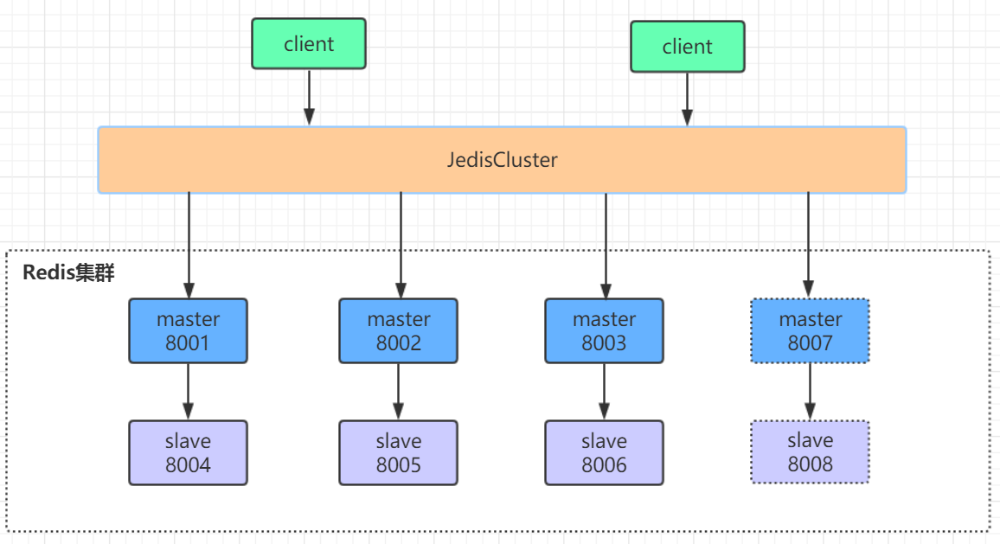

# Redis
## 一、项目leo-redis（基于redis集群模式）
### 1. redis分片算法CRC16
槽位定位算法：**reids默认16384个slots槽位**
使用jedisCluster.set(String, String)插入key-value
==见com.leo.redis.JedisClusterTest==
```java
jedisCluster = new JedisCluster(jedisClusterNode, 6000, 5000, 10, "root", config);
System.out.println(jedisCluster.set("cluster", "redis-cluster")); // redis分片算法CRC16
System.out.println(jedisCluster.get("cluster"));
```
代码走向：(以下方法参数省略)
set() -> run() -> runWithRetries() -> getConnectionFromSlot()
```java
if (tryRandomNode) {
      connection = connectionHandler.getConnection();
    } else {
      connection = connectionHandler.getConnectionFromSlot(JedisClusterCRC16.getSlot(key));
    }
```
**JedisClusterCRC16.getSlot(key)**
对key值使用CRC16算法进行hash得到一个整数值，再对此整数值取模来得到具体槽位。
**HASH_SLOT = CRC16(key) mod 16384**
redis cluster将所有的数据划分为16384个slots(槽位)，每个节点负责一部分槽位。槽位信息存储于每个节点中。
在redis集群中，每个主从节点群只有master有写入权限。在集群搭建完成后每个主从节点群的master均会分配到一定的槽位数（默认平均分配）。
根据key计算得出的槽位值便能定向到拥有指定槽位区间的节点，从而进行数据的读写等操作。

==对key的计算示例见：com.leo.redis.CRC16==
```java
public class CRC16 {
    public static void main(String[] args) {
        String str = "name1";
        System.out.println(JedisClusterCRC16.getCRC16(str) % 16384);
        // redis设计键，使其映射至同一个slot
        System.out.println(JedisClusterCRC16.getSlot("{user1}:id"));
        System.out.println(JedisClusterCRC16.getSlot("{user1}:name"));
    }
}
```

### 2. redis集群Java客户端连接
项目Module: redis-jedis

### 3. springboot整合redis集群连接
项目Module: springboot-redis-sentinel-cluster

## 二、Redis集群
### 1. 高可用集群模式
Redis集群是一个由**多个主从节点群**组成的分布式服务器群，具有**复制、高可用和分片**特性。
Redis集群**不需要sentinel哨兵**也能完成节点移除和故障转移的功能，可水平扩展，性能和高可用性均优于哨兵模式。

### 2. Redis主从架构和哨兵模式
#### 2.1 主从架构
- 主节点master与数据备份节点slave
master节点具有读写权限，而slave只提供读取数据
- 主从复制
涉及redis持久化：RDB快照、AOF（resp协议）与混合持久化（redis 4.0）
redis主从复制方式：全量复制与部分复制
- 全量复制
1.slave发送psync命令同步数据，发送命令之前会与master建立socket长连接
2.master收到psync命令执行bgsave生成最新rdb快照数据
3.send rdb数据
4.send buffer(缓冲区repl_back-buffer: master最近数据的缓存)
5.flush old data
6.生成包含buffer数据的完整rdb并load到内存
7.master通过socket长连接持续把写命令发送给从节点，保证主从数据一致性
**图示：**

- 部分复制
值得注意的是数据的offset偏移量，如果连接断开的时间不长，slave节点的offset还在master节点的复制积压缓冲区repl_back-buffer中，则master会将缓存中offset之后的数据一次性同步给slave节点。
相反，如果offset偏移量之后的数据已经不存在于缓冲区，此时将执行全量同步以保证主从数据一致。
**图示：**


#### 2.2 哨兵模式（redis 2.8引入）

sentinel哨兵是特殊的redis服务，不提供读写服务，主要用来监控redis实例节点。
哨兵架构下client端第一次从哨兵找出redis的主节点，后续便直接访问redis的主节点。
当redis主节点发生变化（原master宕机），哨兵会第一时间感知到，并将新的redis主节点通知给client端。
- 哨兵模式的问题
1.哨兵模式引入了主节点的自动故障转移，提升了redis的高可用性，但无法对从节点进行自动故障转移，在读写分离场景下，从节点故障会导致读服务不可用，需要对从节点做额外的监控，切换操作。
2.由于拥有写权限的只有一个master节点，因此写操作的负载均衡问题依然没有解决，其存储能力也受到单机限制（没法支持很高的并发，单个主节点内存不宜设置过大，否则导致持久化文件过大，影响数据恢复和主从同步的效率）。
3.主节点切换的瞬间存在**访问瞬断**的情况。

### 3. Redis-Cluster
#### 3.1 因哨兵模式问题的放大，在redis 3.0引入了redis-cluster集群方案


#### 3.2 redis-cluster水平扩展
